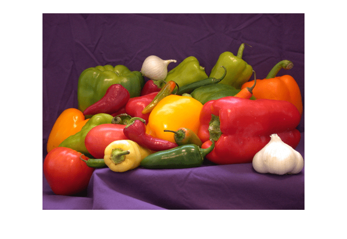
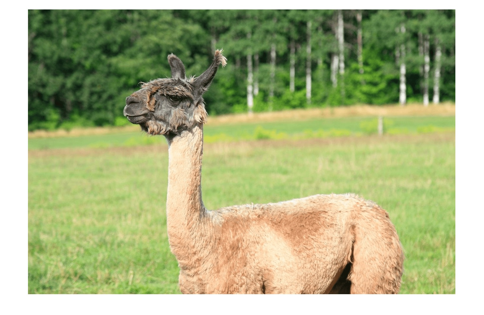

# Visualizing CNN Decision Making Through Occlusion Analysis
<table>
  <tr>
    <td align="center">
      <br>
      <b>peppers.png</b>
    </td>
    <td align="center">
      <br>
      <b>llama.jpg</b>
    </td>
  </tr>
</table>

## CNN Occlusion Sensitivity Analysis Using VGG16

This project investigates how Convolutional Neural Networks (CNNs) make image classification decisions through occlusion sensitivity analysis. Using a pre-trained VGG16 model, portions of two images (*peppers.png* and *llama.jpg*) are systematically masked with gray squares of varying sizes. Changes in classification confidence and predicted classes are analyzed to identify which image regions contribute most strongly to object recognition.

The methodology is inspired by the work of Zeiler and Fergus in *Visualizing and Understanding Convolutional Networks* and demonstrates how visualization techniques can improve understanding of CNN feature extraction, model interpretability, and Explainable Artificial Intelligence (XAI). The project demonstrates fundamental concepts in computer vision, deep learning interpretability, neural network visualization, and model explainability.

---

## Objectives

* Investigate CNN decision-making through occlusion sensitivity analysis.
* Identify image regions most important for object recognition.
* Evaluate the effects of masking on classification confidence.
* Visualize feature sensitivity using Mean Feature Sign Change analysis.
* Explore Explainable AI (XAI) techniques for deep learning models.

---

## Methodology

1. Load a pre-trained VGG16 model trained on the ImageNet dataset.
2. Process two test images:

   * `peppers.png`
   * `llama.jpg`
3. Apply gray square masks of size:

   * 32 × 32 pixels
   * 64 × 64 pixels
   * 128 × 128 pixels
4. Systematically move the mask across each image.
5. Perform inference using VGG16 for every masked image.
6. Record top-5 predicted classes and confidence scores.
7. Analyze classification changes using Mean Feature Sign Change plots and confidence visualizations.

---

## Results

The occlusion experiments demonstrated that different image regions contribute unequally to CNN classification decisions. Smaller mask sizes provided finer-grained insight into feature importance, while larger masks caused broader disruptions to classification confidence.

The *llama.jpg* image generally maintained higher classification confidence under occlusion than *peppers.png*, suggesting that its dominant object features remained more distinguishable when portions of the image were hidden.

---

## Sample Occlusion Results

<p align="center">
  
</p>

<p align="center">
  <strong>Figure 1.</strong> Example occlusion sensitivity analysis results for <em>peppers.png</em> and <em>llama.jpg</em>. Gray masks are applied to image regions while a pre-trained VGG16 network generates updated classification predictions and confidence scores.
</p>

---

## Technologies


---

## Repository Structure

```text
visualizing-cnn-decision-making/
│
├── images/
│   ├── peppers.png
│   └── llama.jpg
│
├── notebooks/
│   └── occlusion_analysis.ipynb
│
├── report/
│   └── CNN_Occlusion_Sensitivity_Analysis_Report.pdf
│
├── README.md
├── requirements.txt
└── LICENSE
```

---

## Installation

```bash
git clone https://github.com/jabuujb/visualizing-cnn-decision-making.git

cd visualizing-cnn-decision-making

pip install -r requirements.txt
```

---

## Report

The accompanying report provides a detailed analysis of CNN interpretability using occlusion sensitivity techniques. It includes experimental procedures, visualizations, classification confidence results, observations, and conclusions regarding feature importance in VGG16 image classification.

📄 **CNN_Occlusion_Sensitivity_Analysis_Report.pdf**

---

## References

[1] M. D. Zeiler and R. Fergus, "Visualizing and Understanding Convolutional Networks," ECCV 2014.

[2] TensorFlow Documentation. Available: https://www.tensorflow.org/

[3] Keras Applications Documentation (VGG16). Available: https://keras.io/api/applications/vgg/

## Author
Justin Ogle

M.S. Electrical Engineering (Automation & Robotics)

LinkedIn: https://www.linkedin.com/in/justin-ogle-b78233b0

GitHub: https://github.com/jabuujb
